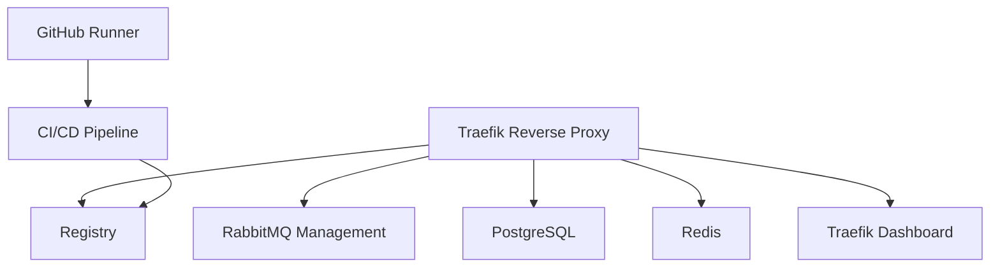

# 🚀 Dolorestec Cluster

[](https://docker.com)
[](https://postgresql.org)
[](https://redis.io)
[](https://rabbitmq.com)
[](https://github.com/features/actions)

Uma infraestrutura Docker completa e moderna para aplicações Dolorestec, com PostgreSQL, Redis, RabbitMQ e GitHub Runner para CI/CD local.

## 📋 Visão Geral

Este projeto configura uma stack completa de serviços para desenvolvimento e produção:

- 🗄️ **PostgreSQL 18** - Banco de dados relacional robusto
- 🔄 **Redis 8.0** - Cache e armazenamento de sessões de alta performance
- 🐰 **RabbitMQ 4.0** - Message broker com management plugin
- 🏃 **GitHub Runner** - CI/CD local com GitHub Actions
- 🌐 **Traefik v3.1** - Reverse proxy moderno e load balancer
   - 📦 **Registry** - GitHub Packages (GHCR) para imagens Docker internas

## ✨ Características

### 🛡️ Segurança e Conformidade
- ✅ Imagens customizadas com prefixo padronizado
- ✅ Usuários não-root para execução segura
- ✅ Secrets management via variáveis de ambiente
- ✅ Healthchecks automatizados
- ✅ Rede isolada com Docker bridge
- ✅ Volumes nomeados para persistência

### 🚀 Performance e Escalabilidade
- ⚡ Restart policies automáticas
- 🔄 Dependências condicionais entre serviços
- 📊 Monitoramento de saúde contínuo
- 🏗️ Arquitetura preparada para produção

### 🔧 DevOps e CI/CD
   - 🤖 GitHub Actions Runner oficial
   - 🐳 Build automatizado de imagens
   - 🔍 Security scanning integrado
   - 📦 SBOM e provenance para rastreabilidade
   - 📦 Imagens publicadas em GitHub Container Registry (GHCR)

## 🔧 Publicação de Imagens (GHCR)

Este projeto usa o GitHub Container Registry (GHCR) para hospedagem de imagens Docker internas. Para permitir publish via `GITHUB_TOKEN`:

- Em `Settings` → `Actions` do repositório, habilite `Read and write permissions` para o `GITHUB_TOKEN`.
- Em `Settings` → `Packages`, confirme permissões de publicação para workflows.

Exemplo de login e push:

```bash
# Login (usando PAT) — em CI usamos ${{ secrets.GITHUB_TOKEN }} automaticamente
echo $PAT | docker login ghcr.io -u $USER --password-stdin

# Tag e push
docker tag dolorestec/postgres:v0.1.0 ghcr.io/<OWNER>/dolorestec/postgres:v0.1.0
docker push ghcr.io/<OWNER>/dolorestec/postgres:v0.1.0
```

## 🏗️ Arquitetura

### 🛡️ Segurança e Conformidade
- ✅ Imagens customizadas com prefixo padronizado
- ✅ Usuários não-root para execução segura
- ✅ Secrets management via variáveis de ambiente
- ✅ Healthchecks automatizados
- ✅ Rede isolada com Docker bridge
- ✅ Volumes nomeados para persistência

### 🚀 Performance e Escalabilidade
- ⚡ Restart policies automáticas
- 🔄 Dependências condicionais entre serviços
- 📊 Monitoramento de saúde contínuo
- 🏗️ Arquitetura preparada para produção

### 🔧 DevOps e CI/CD
- 🤖 GitHub Actions Runner oficial
- 🐳 Build automatizado de imagens
- 🔍 Security scanning integrado
- 📦 SBOM e provenance para rastreabilidade

## 🏗️ Arquitetura



## 🚀 Início Rápido

### Pré-requisitos
- 🐳 Docker 24+
- 🐳 Docker Compose 3.9+
- 🔑 GitHub Repository com secrets configurados

### Instalação

1. **Clone o repositório**
   ```bash
   git clone https://github.com/dolorestec/dolorestec-cluster.git
   cd dolorestec-cluster
   ```

2. **Configure as variáveis de ambiente**
   ```bash
   cp .env.example .env
   # Edite o .env com suas configurações
   ```

3. **Configure o GitHub Runner (opcional)**
   ```bash
   ./setup-runner-token.sh SEU_TOKEN_AQUI
   ```

4. **Inicie a infraestrutura**
   ```bash
   docker-compose up -d
   ```

5. **Verifique o status**
   ```bash
   docker-compose ps
   ```

## 📖 Documentação

### 🗄️ PostgreSQL
- **Versão**: 18
- **Porta**: 5432
- **Database**: Configurável via `.env`

### 🔄 Redis
- **Versão**: 8.0
- **Porta**: 6379
- **Persistência**: AOF habilitado

### 🐰 RabbitMQ
- **Versão**: 4.0
- **Portas**: 5672 (AMQP), 15672 (Management)
- **Management Plugin**: Habilitado

### 🏃 GitHub Runner
- **Versão**: 2.330.0 (oficial)
- **Configuração**: Automática via script
- **CI/CD**: Pipelines locais

### 🌐 Traefik
- **Versão**: v3.1
- **Portas**: 80 (HTTP), 8081 (Dashboard)
- **Configuração**: Labels dinâmicas

## 🔧 Desenvolvimento

### Build Manual
```bash
# Construir todas as imagens
docker-compose build

# Ou construir individualmente
docker-compose build postgres
docker-compose build redis
# ... etc
```

### Testes
```bash
# Validar configuração
docker-compose config

# Executar testes de saúde
docker-compose up -d
docker-compose ps
```

### Configuração GPU NVIDIA
### Logs e Debugging
```bash
# Logs de todos os serviços
docker-compose logs

# Logs específicos
docker-compose logs postgres
docker-compose logs traefik
```

## 📊 Monitoramento

### Healthchecks
Todos os serviços incluem healthchecks automatizados:
- PostgreSQL: Conexão ao banco
- Redis: Comando PING
- RabbitMQ: Diagnóstico de ping
- Traefik: API overview

### Uso de Bancos de Dados

**RabbitMQ:**
- **Message Broker**: Comunicação assíncrona entre serviços (se aplicável)

### Traefik Dashboard
Acesse o dashboard em `http://traefik.dolorestec.local` para visualizar:
- Rotas ativas
- Serviços upstream
- Métricas de performance
- Configuração dinâmica

## 🔒 Segurança

### Melhores Práticas Implementadas
- 🛡️ **Non-root containers**: Todos os serviços rodam como usuários não-privilegiados
- 🔐 **Secrets management**: Credenciais via variáveis de ambiente
- 🌐 **Rede isolada**: Comunicação segura entre containers
- 📊 **Vulnerability scanning**: Trivy integrado no CI/CD
- 📦 **SBOM**: Software Bill of Materials gerado automaticamente

### Configuração de Segurança
- Headers de segurança no Traefik
- Autenticação básica no dashboard
- SSL/TLS preparado para produção
- Rate limiting e proteção contra ataques

## 🚀 CI/CD Pipeline

### GitHub Actions
O pipeline automatiza:
1. 🏗️ **Build**: Compilação de todas as imagens customizadas
2. 📤 **Push**: Upload para Docker Hub
3. 🔍 **Security Scan**: Detecção de vulnerabilidades
4. 📋 **SBOM**: Geração de Software Bill of Materials
5. 🔗 **Provenance**: Attestações de build

### Triggers
- Push para `main` com mudanças em `docker/` ou workflow
- Pull requests para `main`

### Imagens Publicadas (padrão local)
- `dolorestec/postgres:v0.1.0`
- `dolorestec/redis:v0.1.0`
- `dolorestec/rabbitmq:v0.1.0`
- `dolorestec/github-runner:v0.1.0`
- `dolorestec/traefik:v0.1.0`

### Publicação de Imagens (GHCR)

Por padrão nesta infraestrutura as imagens internas são publicadas no GitHub Container Registry (GHCR). Use `GITHUB_TOKEN` em workflows para publicar automaticamente. Passos resumidos para publicar manualmente:

```bash
# Fazer build e tag local
docker build -t dolorestec/postgres:v0.1.0 ./docker/postgres

# Login (usando PAT localmente) — em CI usamos ${{ secrets.GITHUB_TOKEN }} automaticamente
echo $PAT | docker login ghcr.io -u $USER --password-stdin

# Tag e push
docker tag dolorestec/postgres:v0.1.0 ghcr.io/<OWNER>/dolorestec/postgres:v0.1.0
docker push ghcr.io/<OWNER>/dolorestec/postgres:v0.1.0
```

### Registro de pacotes e repositórios
Para pacotes npm/PyPI e repositórios privados, prefira usar os registries oficiais (npm registry, PyPI) ou publicar pacotes privados via GitHub Packages.

## 🐛 Troubleshooting

### Problemas Comuns

#### GitHub Runner não conecta
```bash
# Verificar token
docker-compose logs github-runner

# Regenerar token
./setup-runner-token.sh NOVO_TOKEN
```

#### RabbitMQ falha ao iniciar
```bash
# Verificar logs
docker-compose logs rabbitmq

# Resetar dados
docker-compose down -v
docker-compose up -d rabbitmq
```

#### Traefik não roteia corretamente
```bash
# Verificar configuração
curl http://localhost:8081/api/http/routers

# Verificar /etc/hosts
cat /etc/hosts | grep dolorestec.local
```

### Comandos Úteis
```bash
# Status completo
docker-compose ps

# Reiniciar serviço específico
docker-compose restart postgres

# Limpar tudo
docker-compose down -v --remove-orphans
docker system prune -f
```

## 📚 Recursos Adicionais

- [📖 Documentação Docker](https://docs.docker.com)
- [🐘 PostgreSQL Docs](https://postgresql.org/docs)
- [🔄 Redis Docs](https://redis.io/documentation)
- [🐰 RabbitMQ Docs](https://rabbitmq.com/documentation)
- [🌐 Traefik Docs](https://doc.traefik.io/traefik)

## 🤝 Contribuição

1. Fork o projeto
2. Crie uma branch para sua feature (`git checkout -b feature/AmazingFeature`)
3. Commit suas mudanças (`git commit -m 'Add some AmazingFeature'`)
4. Push para a branch (`git push origin feature/AmazingFeature`)
5. Abra um Pull Request

## 📄 Licença

Este projeto está sob a licença MIT. Veja o arquivo `LICENSE` para mais detalhes.

## 🙏 Agradecimentos

- Equipe Dolorestec pela visão e suporte
- Comunidade open source pelas ferramentas incríveis
- Docker e GitHub pela plataforma excepcional

---

**🚀 Mantido com ❤️ pela equipe Dolorestec** | *Docker 2025 Best Practices Compliant*

---


# CI Test
# Test CI with Docker
# Test CI final
