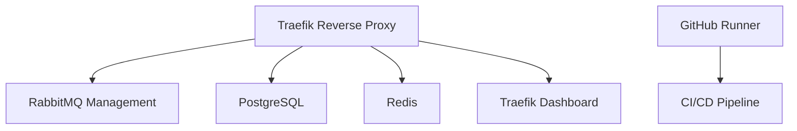

# 🚀 Dolorestec Cluster

[](https://docker.com)
[](https://postgresql.org)
[](https://redis.io)
[](https://rabbitmq.com)
[](https://github.com/features/actions)

Uma infraestrutura Docker completa e moderna para aplicações Dolorestec, com PostgreSQL, Redis, RabbitMQ e GitHub Runner para CI/CD local.

## 📋 Visão Geral

Este projeto configura uma stack completa de serviços para desenvolvimento e produção:

- 🗄️ **PostgreSQL 18** - Banco de dados relacional robusto
- 🔄 **Redis 8.0** - Cache e armazenamento de sessões de alta performance
- 🐰 **RabbitMQ 4.0** - Message broker com management plugin
- 🏃 **GitHub Runner** - CI/CD local com GitHub Actions
- 🌐 **Traefik v3.1** - Reverse proxy moderno e load balancer

## ✨ Características

### 🛡️ Segurança e Conformidade
- ✅ Imagens customizadas com prefixo padronizado
- ✅ Usuários não-root para execução segura
- ✅ Secrets management via variáveis de ambiente
- ✅ Healthchecks automatizados
- ✅ Rede isolada com Docker bridge
- ✅ Volumes nomeados para persistência

### 🚀 Performance e Escalabilidade
- ⚡ Restart policies automáticas
- 🔄 Dependências condicionais entre serviços
- 📊 Monitoramento de saúde contínuo
- 🏗️ Arquitetura preparada para produção

### 🔧 DevOps e CI/CD
- 🤖 GitHub Actions Runner oficial
- 🐳 Build automatizado de imagens
- 🔍 Security scanning integrado
- 📦 SBOM e provenance para rastreabilidade

## 🏗️ Arquitetura



## 🚀 Início Rápido

### Pré-requisitos
- 🐳 Docker 24+
- 🐳 Docker Compose 3.9+
- 🔑 GitHub Repository com secrets configurados

### Instalação

1. **Clone o repositório**
   ```bash
   git clone https://github.com/dolorestec/dolorestec-cluster.git
   cd dolorestec-cluster
   ```

2. **Configure as variáveis de ambiente**
   ```bash
   cp .env.example .env
   # Edite o .env com suas configurações
   ```

3. **Configure o GitHub Runner (opcional)**
   ```bash
   ./setup-runner-token.sh SEU_TOKEN_AQUI
   ```

4. **Inicie a infraestrutura**
   ```bash
   docker-compose up -d
   ```

5. **Verifique o status**
   ```bash
   docker-compose ps
   ```

## 📖 Documentação

### 🗄️ PostgreSQL
- **Versão**: 18
- **Porta**: 5432
- **Database**: Configurável via `.env`

### 🔄 Redis
- **Versão**: 8.0
- **Porta**: 6379
- **Persistência**: AOF habilitado

### 🐰 RabbitMQ
- **Versão**: 4.0
- **Portas**: 5672 (AMQP), 15672 (Management)
- **Management Plugin**: Habilitado

### 🏃 GitHub Runner
- **Versão**: 2.330.0 (oficial)
- **Configuração**: Automática via script
- **CI/CD**: Pipelines locais

### 🌐 Traefik
- **Versão**: v3.1
- **Portas**: 80 (HTTP), 8081 (Dashboard)
- **Configuração**: Labels dinâmicas

## 🔧 Desenvolvimento

### Build Manual
```bash
# Construir todas as imagens
docker-compose build

# Ou construir individualmente
docker-compose build postgres
docker-compose build redis
# ... etc
```

### Testes
```bash
# Validar configuração
docker-compose config

# Executar testes de saúde
docker-compose up -d
docker-compose ps
```

### Configuração GPU NVIDIA
### Logs e Debugging
```bash
# Logs de todos os serviços
docker-compose logs

# Logs específicos
docker-compose logs postgres
docker-compose logs traefik
```

## 📊 Monitoramento

### Healthchecks
Todos os serviços incluem healthchecks automatizados:
- PostgreSQL: Conexão ao banco
- Redis: Comando PING
- RabbitMQ: Diagnóstico de ping
- Traefik: API overview

### Uso de Bancos de Dados

**RabbitMQ:**
- **Message Broker**: Comunicação assíncrona entre serviços (se aplicável)

### Traefik Dashboard
Acesse o dashboard em `http://traefik.dolorestec.local` para visualizar:
- Rotas ativas
- Serviços upstream
- Métricas de performance
- Configuração dinâmica

## 🔒 Segurança

### Melhores Práticas Implementadas
- 🛡️ **Non-root containers**: Todos os serviços rodam como usuários não-privilegiados
- 🔐 **Secrets management**: Credenciais via variáveis de ambiente
- 🌐 **Rede isolada**: Comunicação segura entre containers
- 📊 **Vulnerability scanning**: Trivy integrado no CI/CD
- 📦 **SBOM**: Software Bill of Materials gerado automaticamente

### Configuração de Segurança
- Headers de segurança no Traefik
- Autenticação básica no dashboard
- SSL/TLS preparado para produção
- Rate limiting e proteção contra ataques

## 🚀 CI/CD Pipeline

### GitHub Actions
O pipeline automatiza:
1. 🏗️ **Build**: Compilação de todas as imagens customizadas
2. 📤 **Push**: Upload para Docker Hub
3. 🔍 **Security Scan**: Detecção de vulnerabilidades
4. 📋 **SBOM**: Geração de Software Bill of Materials
5. 🔗 **Provenance**: Attestações de build

### Triggers
- Push para `main` com mudanças em `docker/` ou workflow
- Pull requests para `main`

### Imagens Publicadas (padrão local)
- `dolorestec/postgres:v0.1.0`
- `dolorestec/redis:v0.1.0`
- `dolorestec/rabbitmq:v0.1.0`
- `dolorestec/github-runner:v0.1.0`
- `dolorestec/traefik:v0.1.0`

### Usar Nexus local como registry
Por padrão nesta infraestrutura as imagens internas são publicadas em um registry local (Sonatype Nexus) exposto via Traefik. Exemplo de fluxo para publicar uma imagem localmente:

```bash
# Fazer build e tag local
docker build -t dolorestec/postgres:v0.1.0 ./docker/postgres

# Fazer login no Nexus (substitua hostname/porta conforme sua configuração Traefik)
docker login nexus.dolorestec.local -u <usuario> -p <senha>

# Taggear para apontar ao registry (se necessário)
docker tag dolorestec/postgres:v0.1.0 nexus.dolorestec.local/dolorestec/postgres:v0.1.0

# Push para o Nexus
docker push nexus.dolorestec.local/dolorestec/postgres:v0.1.0
```

Lembre-se de rotacionar a senha admin do Nexus e não commitar credenciais no repositório. Configure `~/.docker/config.json` e os secrets do CI para autenticação segura.

### Repositórios criados no Nexus
O script de inicialização criou os seguintes repositórios hospedados no Nexus:

- `docker-hosted`
- `npm-hosted`
- `pypi-hosted`

Exemplo de push para imagens Docker (HTTP path). Atenção: o Docker client pode exigir configuração de "insecure-registries" se não houver TLS:

```bash
# Tag local
docker tag dolorestec/postgres:v0.1.0 nexus.dolorestec.local:8081/repository/docker-hosted/dolorestec/postgres:v0.1.0

# Push (pode precisar de login e configuração insegura se sem TLS)
docker login nexus.dolorestec.local:8081
docker push nexus.dolorestec.local:8081/repository/docker-hosted/dolorestec/postgres:v0.1.0
```

Se preferir, configure o repositório Docker no Nexus para escutar em uma porta dedicada (ex.: 5000) e ajuste o Traefik para rotear TCP nessa porta — isso permite usar `nexus.dolorestec.local:5000` como registry padrão.

## 🐛 Troubleshooting

### Problemas Comuns

#### GitHub Runner não conecta
```bash
# Verificar token
docker-compose logs github-runner

# Regenerar token
./setup-runner-token.sh NOVO_TOKEN
```

#### RabbitMQ falha ao iniciar
```bash
# Verificar logs
docker-compose logs rabbitmq

# Resetar dados
docker-compose down -v
docker-compose up -d rabbitmq
```

#### Traefik não roteia corretamente
```bash
# Verificar configuração
curl http://localhost:8081/api/http/routers

# Verificar /etc/hosts
cat /etc/hosts | grep dolorestec.local
```

### Comandos Úteis
```bash
# Status completo
docker-compose ps

# Reiniciar serviço específico
docker-compose restart postgres

# Limpar tudo
docker-compose down -v --remove-orphans
docker system prune -f
```

## 📚 Recursos Adicionais

- [📖 Documentação Docker](https://docs.docker.com)
- [🐘 PostgreSQL Docs](https://postgresql.org/docs)
- [🔄 Redis Docs](https://redis.io/documentation)
- [🐰 RabbitMQ Docs](https://rabbitmq.com/documentation)
- [🌐 Traefik Docs](https://doc.traefik.io/traefik)

## 🤝 Contribuição

1. Fork o projeto
2. Crie uma branch para sua feature (`git checkout -b feature/AmazingFeature`)
3. Commit suas mudanças (`git commit -m 'Add some AmazingFeature'`)
4. Push para a branch (`git push origin feature/AmazingFeature`)
5. Abra um Pull Request

## 📄 Licença

Este projeto está sob a licença MIT. Veja o arquivo `LICENSE` para mais detalhes.

## 🙏 Agradecimentos

- Equipe Dolorestec pela visão e suporte
- Comunidade open source pelas ferramentas incríveis
- Docker e GitHub pela plataforma excepcional

---

**🚀 Mantido com ❤️ pela equipe Dolorestec** | *Docker 2025 Best Practices Compliant*

---

## 📦 Sonatype Nexus (Registry + PyPI + npm)

Adicionamos um serviço opcional `nexus` para hospedar um registry Docker privado e repositórios `npm`/`PyPI`.

Rápido resumo de uso:

- Inicie o Nexus junto com a stack:

```bash
docker-compose up -d nexus
```

- Recupere a senha admin inicial (de dentro do container):

```bash
docker exec dolorestec-nexus cat /nexus-data/admin.password
```

- Proteja o Nexus com Basic Auth: gere um arquivo htpasswd (bcrypt) e coloque em `docker/traefik/dynamic/htpasswd`.
   Veja `docker/traefik/dynamic/htpasswd.example` para instruções.

- Inicialize repositórios úteis (docker-hosted, npm-hosted, pypi-hosted):

```bash
export NEXUS_URL=http://nexus.dolorestec.local:8081
export NEXUS_USER=admin
export NEXUS_PASS=$(docker exec dolorestec-nexus cat /nexus-data/admin.password)
./scripts/nexus-init.sh
```

- Exemplos de configuração para CI/clients estão em `templates/` (ex.: `.npmrc.example`, `pip.conf.example`).

Observações de segurança:
- Não exponha o Nexus sem TLS e autenticação em ambientes públicos.
- Faça backup regular de `nexus_data`.

# CI Test
